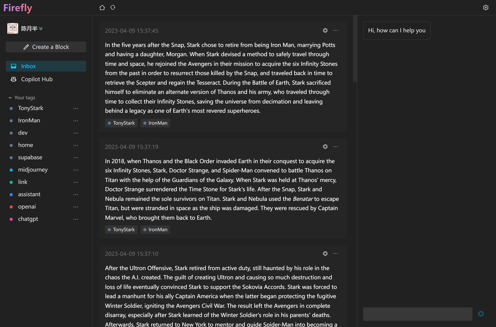

# Firefly

Firefly 是一个开源轻量化 AI 驱动的备忘录应用

[English](./README.md) | 简体中文 • Discuss in [Discord](https://discord.gg/qxqNEGyH3k) / [Telegram](https://t.me/+Q3_77Ajx8jE5YTFl)



## 使用方式

- [Web App](https://firefly.best)
- [客户端](https://github.com/chenyueban/firefly/releases)

## 功能

### 主要功能

- 🤖 AI: 与 AI 对话，将您收集到的信息一键交予 AI 处理，并且一键收集 AI 回复的内容

- 📥 Capture: 支持OCR识图收集、快捷键收集、划词图标收集等

- 🔥 Copilot Hub !!: 可以将你收集到的信息交于 AI 训练, 生成一个垂直领域的 自定义"ChatGPT". 当然你可以将你创建的 Copilot 链接分享出去, 让别人可以和你创建的 Copilot 聊天.

### 更多功能

- Markdown 支持: 轻松编写 Markdown 文本，支持几乎所有 Markdown 元素

- 标签系统: 通过标签管理你的碎片信息

- ...... _更多功能等你一探究竟！_

## 手动安装

1. 在 [Latest Release](https://github.com/chenyueban/firefly/releases/latest) 页面下载以 `.msi` 结尾的安装包
2. 下载完成后双击安装包进行安装
3. 如果提示不安全，可以点击 `更多信息` -> `仍要运行` 进行安装
4. 开始使用吧！

## MacOS

### 手动安装

1. 去 [Latest Release](https://github.com/chenyueban/firefly/releases/latest) 页面下载对应芯片以 `.dmg` 的安装包（Apple Silicon机器请使用aarch64版本，并注意执行下文`xattr`指令）
2. 下载完成后双击安装包进行安装，然后将 `Firefly` 拖动到 `Applications` 文件夹。
3. 开始使用吧！

### 故障排除

- "Firefly" can’t be opened because the developer cannot be verified.

  <p align="center">
    
  </p>

  - 点击 `Cancel` 按钮，然后去 `设置` -> `隐私与安全性` 页面，点击 `仍要打开` 按钮，然后在弹出窗口里点击 `打开` 按钮即可，以后打开 `Firefly` 就再也不会有任何弹窗告警了 🎉

    <p align="center">
       
    </p>

  - 如果在 `隐私与安全性` 中找不到以上选项，或启动时提示文件损坏（Apple Silicon版本）。打开 `Terminal.app`，并输入以下命令（中途可能需要输入密码），然后重启 `Firefly` 即可：

    ```sh
    sudo xattr -d com.apple.quarantine /Applications/Firefly.app
    ```

- 如果您每次打开它都遇到权限提示，或者无法执行快捷键划词翻译，请前往 `设置` -> `隐私与安全性` -> `辅助功能` 中删除 Firefly，然后重新添加 Firefly:

## 感谢

[openai-translator](https://github.com/yetone/openai-translator) 本项目客户端部分功能是受它启发

## License

[LICENSE](./LICENSE)
